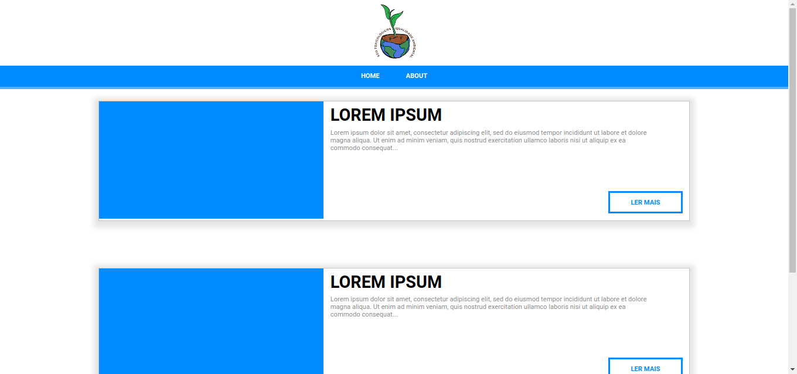

# eco-toxicologicos-qualidade-ambiental



<hr>
&nbsp;

## Initial Figma Project
https://www.figma.com/file/EUWmdyBWSCDEjWN3AFe5d3/Projeto-Eco-T%C3%B3xicologos-Qualidade-Ambiental?node-id=0%3A1

## Project setup
```
yarn install
```

### Compiles and hot-reloads for development
```
yarn serve
```

### Compiles and minifies for production
```
yarn build
```

### Lints and fixes files
```
yarn lint
```

### Customize configuration
See [Configuration Reference](https://cli.vuejs.org/config/).

&nbsp;
<hr>
&nbsp;

Project Developed By 2nd NTI - ETEC Lorena, SP
